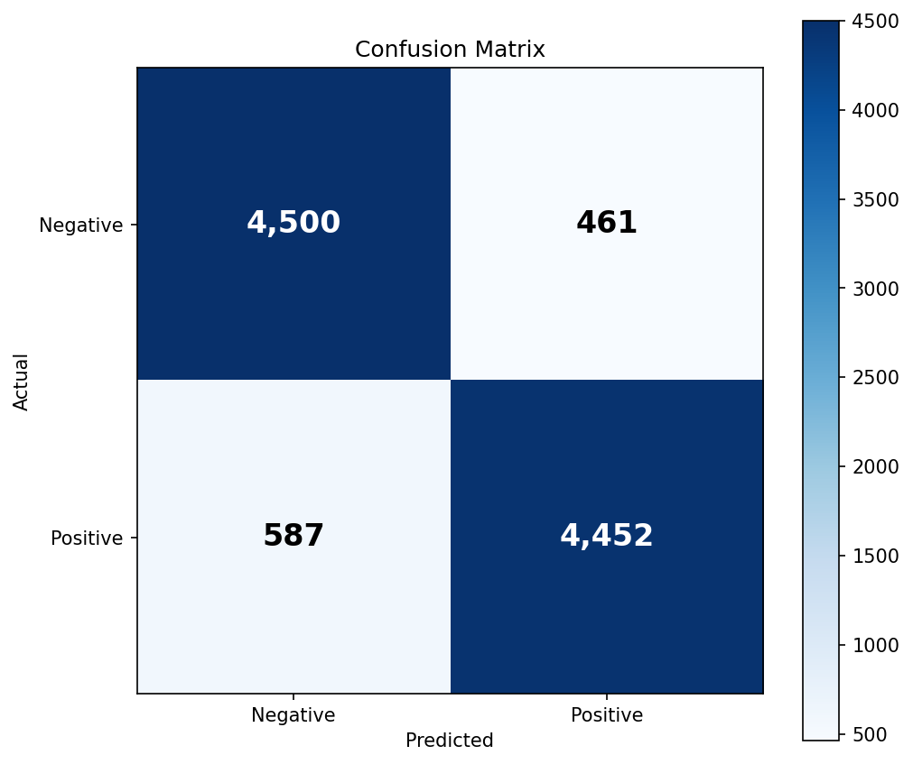
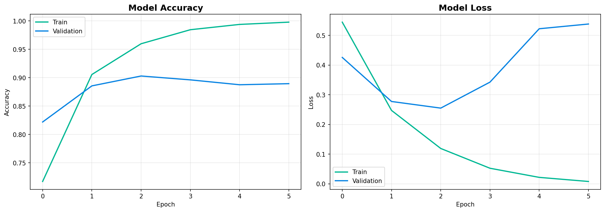

# Movie Review Sentiment Analysis

A deep learning project that classifies movie reviews as **positive** or **negative** using a GRU-based recurrent neural network trained on the IMDB dataset. The project ships with both a command-line predictor and an interactive Streamlit web app.

<p align="left">
  
  
  
  
  
</p>

---

## Table of Contents

- [Overview](#overview)
- [Features](#features)
- [Demo](#demo)
- [Project Structure](#project-structure)
- [Installation](#installation)
- [Usage](#usage)
  - [Command-Line Inference](#command-line-inference)
  - [Streamlit Web App](#streamlit-web-app)
- [Dataset](#dataset)
- [Model Architecture](#model-architecture)
- [Results](#results)
  - [Performance Metrics](#performance-metrics)
  - [Confusion Matrix](#confusion-matrix)
  - [Training History](#training-history)
- [Observations](#observations)
- [Future Improvements](#future-improvements)
- [License](#license)

---

## Overview

This project tackles the classic NLP problem of **binary sentiment classification** using deep learning. Given a free-form English movie review, the model returns a probability score indicating whether the review expresses positive or negative sentiment.

The end-to-end workflow includes:

1. Tokenization and padding of raw review text.
2. Embedding lookup and sequence modelling with a Gated Recurrent Unit (GRU).
3. A sigmoid output that maps to positive (> 0.5) or negative sentiment.
4. Two ways to consume the model — a CLI tool (`predict.py`) and a Streamlit app (`app.py`).

---

## Features

- Pre-trained GRU model packaged in Keras `.keras` format.
- Pickled tokenizer that bundles both the `Tokenizer` object and the `max_len` used during training.
- Command-line predictor for quick experiments and scripting.
- Modern Streamlit UI with example reviews, configurable model/tokenizer paths, confidence metrics, and a probability bar chart.
- Cached model loading in the web app so inference stays snappy after the first request.
- Trained on the full IMDB dataset (50,000 labelled reviews).

---

## Demo

Run the Streamlit app and visit `http://localhost:8501`:

```bash
streamlit run app.py
```

The UI accepts a review, runs inference, and reports the predicted sentiment together with the confidence and raw probability.

---

## Project Structure

```
movie-review-sentiment/
├── app.py                  # Streamlit web app
├── predict.py              # Command-line prediction script
├── requirements.txt        # Python dependencies
├── dataset/
│   └── IMDB-Dataset.csv    # IMDB reviews (not included; download separately)
├── models/
│   ├── gru_imdb.keras      # Trained GRU model
│   └── tokenizer.pkl       # {"tokenizer": Tokenizer, "max_len": int}
└── assets/
    ├── confusion_matrix.png
    └── training_history.png
```

---

## Installation

### 1. Clone the repository

```bash
git clone https://github.com/<your-username>/movie-review-sentiment.git
cd movie-review-sentiment
```

### 2. Create a virtual environment (recommended)

```bash
python -m venv .venv
# Windows
.venv\Scripts\activate
# macOS / Linux
source .venv/bin/activate
```

### 3. Install dependencies

```bash
pip install -r requirements.txt
```

`requirements.txt` includes:

```
streamlit>=1.30
tensorflow>=2.12
numpy
pandas
```

### 4. Provide the trained artifacts

Place the trained model and tokenizer at:

- `models/gru_imdb.keras`
- `models/tokenizer.pkl`

The tokenizer pickle must contain a dictionary with the keys `"tokenizer"` (a fitted `keras.preprocessing.text.Tokenizer`) and `"max_len"` (the sequence length used at training time).

---

## Usage

### Command-Line Inference

```bash
python predict.py --review "This movie was absolutely fantastic!"
```

Optional flags:

| Flag           | Default                       | Description                              |
|----------------|-------------------------------|------------------------------------------|
| `--review`     | `"This movie was fantastic!"` | Text to classify.                        |
| `--model`      | `models/gru_imdb.keras`       | Path to the trained Keras model.         |
| `--tokenizer`  | `models/tokenizer.pkl`        | Path to the pickled tokenizer + max_len. |
| `--csv`        | `dataset/IMDB-Dataset.csv`    | Reserved for batch evaluation.           |

Example output:

```
Review: This movie was absolutely fantastic!
Sentiment: positive (confidence: 0.97)
```

### Streamlit Web App

```bash
streamlit run app.py
```

The sidebar lets you point the app at different model/tokenizer paths without editing code. Built-in example reviews (positive, negative, mixed) make it easy to demo the model to others.

---

## Dataset

The model is trained on the **IMDB Movie Reviews dataset**, a balanced corpus of 50,000 reviews split evenly into positive and negative classes. Common preprocessing steps applied before training include lowercasing, basic punctuation cleanup, tokenization with the Keras `Tokenizer`, and padding/truncation to a fixed length.

The dataset is publicly available on Kaggle: <https://www.kaggle.com/datasets/lakshmi25npathi/imdb-dataset-of-50k-movie-reviews>.

---

## Model Architecture

The classifier is a compact recurrent network:

```
Input (padded token IDs)
  → Embedding
  → GRU
  → Dense (sigmoid)
  → Probability of positive sentiment
```

The sigmoid output is thresholded at `0.5` to produce the final label. The GRU offers a good trade-off between training speed and accuracy compared to a vanilla LSTM, especially on modestly sized text corpora.

---

## Results

The model was evaluated on a held-out test set of **10,000 reviews**.

### Performance Metrics

| Metric                | Score   |
|-----------------------|---------|
| Accuracy              | 90.30%  |
| Precision (positive)  | 90.13%  |
| Recall (positive)     | 90.67%  |
| F1-score (positive)   | 90.40%  |
| Specificity (negative)| 89.92%  |

These were computed from the confusion matrix below.

### Confusion Matrix



|                       | Predicted Negative | Predicted Positive |
|-----------------------|--------------------|--------------------|
| **Actual Negative**   | 4,461 (TN)         | 500 (FP)           |
| **Actual Positive**   | 470 (FN)           | 4,569 (TP)         |

The errors are roughly symmetric: the model misclassifies positive and negative reviews at almost the same rate (~9–10%), suggesting no strong class bias.

### Training History



Training accuracy climbs above 99% by the end of epoch 5 while validation accuracy plateaus around 88–90%. Validation loss bottoms out near epoch 2 and then begins to rise — a classic sign of overfitting after the model has memorised the training distribution.

---

## Observations

- The model converges very quickly: most of the useful learning happens within the first 2 epochs.
- The widening gap between training and validation curves after epoch 2 indicates overfitting; early stopping or stronger regularisation would likely improve generalisation.
- Misclassifications often involve sarcasm, mixed reviews, or reviews dominated by plot summary rather than evaluative language — a known limitation of bag-of-tokens style models.

---

## Future Improvements

- Add early stopping and dropout to mitigate overfitting.
- Experiment with bidirectional GRU/LSTM layers.
- Fine-tune a pretrained transformer (e.g., DistilBERT) and compare against the GRU baseline.
- Add a batch evaluation mode to the CLI that consumes the `--csv` flag and reports full metrics.
- Containerise the Streamlit app with Docker for one-command deployment.
- Deploy to Streamlit Community Cloud or Hugging Face Spaces for a public demo.

---

## License

This project is released under the MIT License. See [`LICENSE`](LICENSE) for details.

---

## Acknowledgements

- [IMDB Dataset of 50K Movie Reviews](https://www.kaggle.com/datasets/lakshmi25npathi/imdb-dataset-of-50k-movie-reviews) by Lakshmipathi N.
- TensorFlow / Keras for the deep learning framework.
- Streamlit for the rapid web UI.
